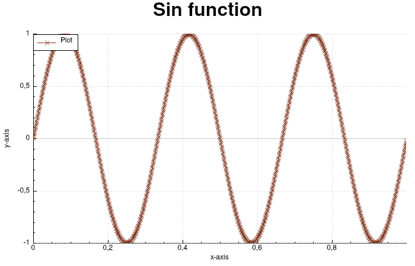

# Plotcpp

**Plotcpp** is a simple library which provides some tools to quickly create plots in C++. It is built
on top of [qcustomplot 2.0](www.qcustomplot.com) and [Qt 5.15](qt.io/) but can be used
independently in a project once compiled.

## Example

<center>
	
</center>

```cpp
#include <plotcpp/figure.hpp>

#include <vector>
#include <cmath>
#include <algorithm>

int main(int argc, char* argv[]) {
	std::vector<double> x, y;
	const double pi = std::atan(1)*4;
	const double f0 = 3;
	const double delta = 1.0/1000;

	for (double t=0; t<=1; t+=delta) {
		x.push_back(t);
		y.push_back(std::sin(2*pi*f0*t));
	}

	pcpp::Figure figure{argc, argv, 1, 1};

	figure.title("Sin function");
	figure.xlabel("x-axis");
	figure.ylabel("y-axis");
	figure.legend();
	figure.range(-0.1, 1.1, -1.1, 1.1);

	auto plot = figure.plot(x, y, "Plot");
	plot.color(127, 54, 32);
	plot.style(pcpp::Style::cross);
	figure.save("images/sin.png", pcpp::Format::png);
	return figure.show();
}
```

## Basics

The library is centered around 2 widgets which can be included in any Qt application:

* `PlotWidget`: displays plots in a grid;
* `AnimationWidget`: allows user to pass functions which will modify the underlying `PlotWidget` and can be controlled with signals.

**Plotcpp** can be used without including **Qt** or **qcustomplot** in your
project using the default plot and animation windows created with the classes
`Figure` and `Animation`. They provide a default interface which allows to
interact with the plot and save it.

For more details about how to build plots, see the examples.

## Installation

To install the library, you have to install **Qt** and **qcustomplot**. Then do the following:

```bash
git clone https://github.com/CourrierGui/plotcpp
cd plotcpp
```

### Compilation and installation

```bash
mkdir build
cmake -B build -DCMAKE_BUILD_TYPE=Release
cmake --build build
cmake --install build --prefix /usr
```

On Arch based distributions:

```bash
makepkg -si
```
